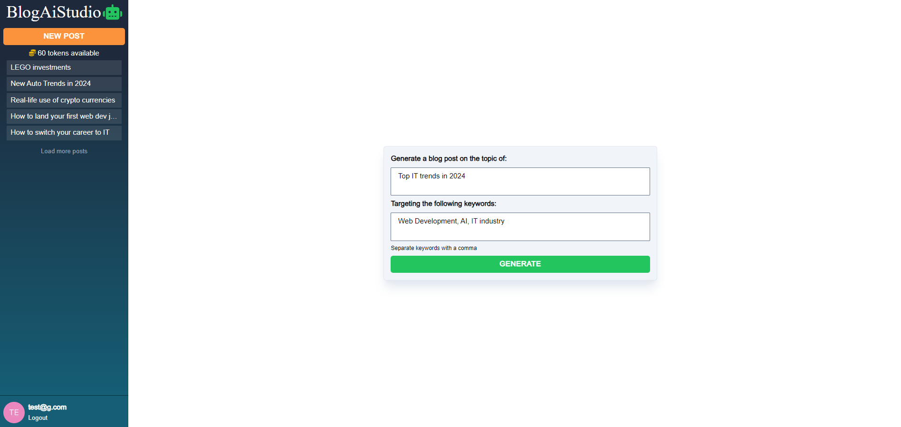
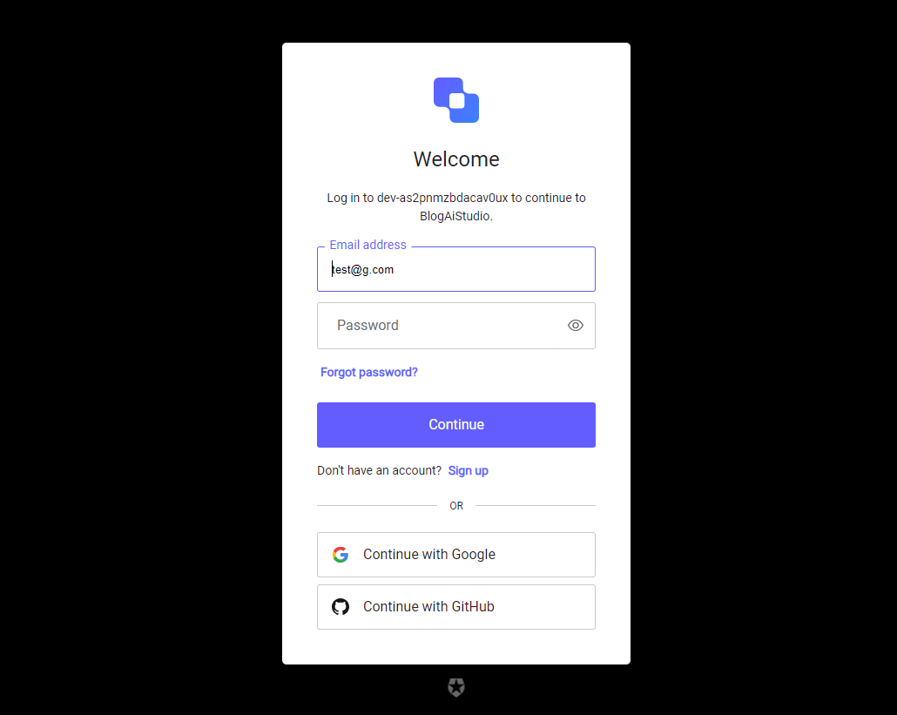
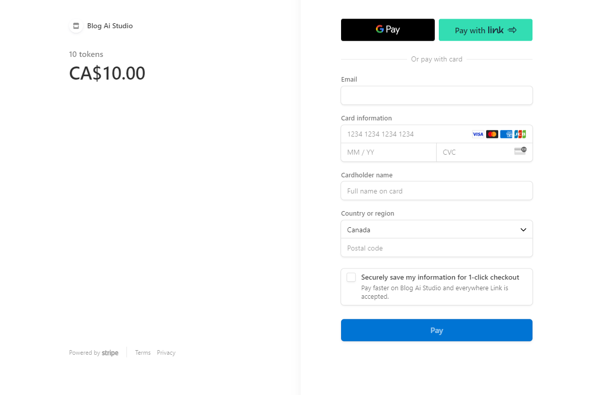

## BlogAiStudio
A Software-As-A-Service application to generate an SEO-friendly blog post. <br>
Build with `NextJS`, `Tailwind`, `MongoDB`, `OpenAI`, `Stripe` and `Auth0`.<br>
Deployed on [DigitalOcean](https://www.digitalocean.com/) - https://coral-app-5lxxp.ondigitalocean.app/ <br>
To try it out for free use: test@g.com and A!123456

Upon launching the app, users are welcomed by a vibrant and animated start screen. To begin, pressing the "Begin" button will guide new users to the `Auth0` registration page for account setup. Once authenticated, users will be directed to a creative interface where they can compose their blog posts. Here, you simply enter a general topic and relevant keywords to start crafting your content.

On the left side of the screen, you will find a dashboard displaying a "New Post" button and your available token balance. Clicking on this will take you to the `Stripe` payment gateway, where you can purchase additional tokens. Below the dashboard is a list showcasing all previously generated blog posts.

At the footer of the app, there are user account details and a logout option for your convenience.

The cost to generate one blog post is 1 token. A bundle of 10 tokens can be purchased for 10 CAD, with taxes included.

Within the post page, users can view the SEO title, meta description, and keywords, as well as the blog post content itself. A "Delete Post" button is also provided at the bottom of the page for easy content management.
___
#### Start page


#### Generate blog page


#### Blog Post


#### Authenticatin/Registration


#### Stripe Payment

___

### Dependencies
   - "@auth0/nextjs-auth0": "^2.2.1",
   - "@fortawesome/fontawesome-svg-core": "^6.2.1",
   - "@fortawesome/free-solid-svg-icons": "^6.2.1",
   - "@fortawesome/react-fontawesome": "^0.2.0",
   - "@next/font": "^13.1.6",
   - "@webdeveducation/next-verify-stripe": "^1.0.1",
   - "micro-cors": "^0.1.1",
   - "mongodb": "^4.13.0",
   - "next": "13.1.6",
   - "numeral": "^2.0.6",
   - "openai": "^3.2.1",
   - "react": "18.2.0",
   - "react-dom": "18.2.0",
   - "react-markdown": "^9.0.1",
   - "sharp": "^0.32.1",
   - "stripe": "^11.8.0"
   - "autoprefixer": "^10.4.13",
   - "eslint": "8.33.0",
   - "eslint-config-next": "13.1.6",
   - "postcss": "^8.4.21",
   - "tailwindcss": "^3.2.4"
   ---
OpenAI model: `gpt-4-1106-preview`

##### Fonts:
- body - DM Sans
- headings & Logo: DM Serif Display


##### MongoDb:
- name - BlogAiStudio
- tables - posts, users.

post content:
- _id
- postContent
- title
- metaDescription
- topic
- keywords
- userId
- created


[stripe handle webhook events documentation](https://dashboard.stripe.com/test/webhooks/create?endpoint_location=local) <br>

Don't forget to Fix Font Awesome flash of massive icon on load in production with:
- ```import '@fortawesome/fontawesome-svg-core/styles.css'; ``` 
- ```import { config } from '@fortawesome/fontawesome-svg-core';``` 
- ```config.autoAddCss = false;```
---
Created by [Artur](https://github.com/mr-Arturio) folowing [Udemy Course](https://www.udemy.com/course/next-js-ai/?couponCode=ST12MT030524)
